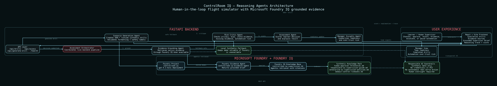

# ControlRoom IQ

**Human-in-the-loop flight simulator for AI supervisors.**

ControlRoom IQ is a Microsoft Agents League **Reasoning Agents** project that trains employees to safely supervise AI agents before automation reaches real enterprise workflows.

Demo video: https://youtu.be/bgDFGwl3gc4

Architecture diagram: [`docs/assets/controlroom-iq-architecture.png`](docs/assets/controlroom-iq-architecture.png)

GitHub repository: https://github.com/fxcepalmzzz/controlroom-iq

## Tagline

Train humans to supervise AI before agents act in the real world.

## Problem

Enterprise AI agents are starting to recommend actions, influence decisions, and trigger workflows. The risk is that employees may over-trust those recommendations without checking whether the AI has enough evidence, whether the source is current, or whether human approval is required.

The missing enterprise skill is not only building AI agents. It is knowing when humans should stop them.

ControlRoom IQ trains that supervision skill through realistic synthetic drills.

## What the app does

ControlRoom IQ presents the learner with workplace AI supervision scenarios. Each scenario includes:

* A simulated AI worker recommendation
* A hidden risk
* Synthetic policy evidence
* A required human decision
* A score and explanation
* A visible multi-agent reasoning trace
* Manager-level readiness insights

The learner must choose one of five supervision actions:

* Approve
* Reject
* Ask for evidence
* Escalate
* Pause automation

The system then assesses whether the learner made a safe human-in-the-loop decision.

## Architecture diagram



The diagram shows the full ControlRoom IQ flow: React frontend, FastAPI backend, multi-agent orchestration, Microsoft Foundry, Foundry IQ grounded retrieval, synthetic knowledge documents, runtime generated drills, and responsible AI guardrails.

## Key features

* 15 curated synthetic AI supervision drills
* Runtime AI-generated supervision drills
* Microsoft Foundry integration
* Foundry IQ grounded evidence retrieval
* Foundry evidence agent connected to a synthetic knowledge base
* Multi-agent assessment pipeline
* Grounded Supervisor Brief with source documents
* Risk Critic flags for unsafe automation patterns
* Manager Insights Agent readiness summary
* Backend online/offline fallback mode
* Synthetic data only
* No real customer data, employee data, credentials, or confidential information

## Microsoft Agents League track fit

ControlRoom IQ is built for the **Reasoning Agents** track.

It demonstrates:

* Multi-agent system design
* Multi-step reasoning
* Grounded knowledge retrieval through Microsoft Foundry IQ
* Visible orchestration traces
* Human oversight for important decisions
* Responsible AI guardrails
* Synthetic data and synthetic documents only

## Microsoft IQ integration

ControlRoom IQ integrates **Microsoft Foundry IQ** as the main Microsoft IQ layer.

The app uses a Microsoft Foundry project and a Foundry evidence agent connected to a Foundry IQ knowledge base. The knowledge base contains synthetic policy and runbook documents. When a learner submits a decision, the Evidence Grounding Agent queries the Foundry IQ agent and returns a grounded supervisor brief with source document references.

If Foundry IQ is unavailable during local testing or demo conditions, the app uses local synthetic policy references as a safe fallback so the simulator remains demoable without real enterprise data.

## Multi-agent architecture

ControlRoom IQ uses specialised agents with clear responsibilities.

1. **Scenario Director Agent**
   Creates curated and runtime-generated synthetic AI supervision drills.

2. **Simulated AI Worker Agent**
   Produces the AI recommendation that the human learner must supervise.

3. **Evidence Grounding Agent**
   Retrieves policy evidence through Microsoft Foundry IQ when configured, with local synthetic fallback references when unavailable.

4. **Risk Critic Agent**
   Checks for missing evidence, stale sources, privacy leakage, bias, governance risk, and unsafe automation.

5. **Assessment Agent**
   Scores the learner decision against the safe-supervision rubric and explains whether the intervention was appropriate.

6. **Manager Insights Agent**
   Summarises team readiness, completed drills, and automation over-trust risk.

## Live assessment flow

When the learner chooses a supervision action, the backend runs this live pipeline:

```text
Learner decision
      ↓
FastAPI backend
      ↓
Evidence Grounding Agent
      ↓
Microsoft Foundry IQ evidence retrieval
      ↓
Risk Critic Agent
      ↓
Assessment Agent
      ↓
Score, explanation, evidence, risk flags, and trace
      ↓
Manager Insights Agent summary
```

Before a decision is submitted, the frontend shows the full conceptual six-step supervision workflow. After a decision is submitted, it switches to the live backend orchestration trace returned by the assessment pipeline.

## Runtime generated drills

ControlRoom IQ also supports runtime AI-generated drills.

The backend Scenario Director Agent creates new synthetic enterprise supervision scenarios using the configured Foundry model. Generated drills are marked with a `GEN-` identifier and an “AI-generated drill · runtime synthetic” badge in the UI.

Generated drills are assessed through the same pipeline as curated drills:

* Evidence Grounding Agent
* Foundry IQ grounding
* Risk Critic Agent
* Assessment Agent
* Manager Insights Agent

Generation guardrails ensure that runtime drills use fictional entities, avoid real personal data, avoid credentials, and use safe scoring labels.

## Synthetic knowledge base

The Foundry IQ knowledge base uses synthetic documents only, including:

* `human-approval-thresholds.md`
* `responsible-ai-supervision-guide.md`
* `enterprise-ai-supervision-policies.md`
* `domain-control-runbooks.md`

These documents describe fictional AI supervision policies, approval thresholds, escalation rules, data handling rules, and domain-specific runbooks.

## Safety and data handling

ControlRoom IQ uses synthetic data only.

The project does not include:

* Real customer data
* Real employee data
* Real HR records
* Real procurement records
* Real support tickets
* Real emails
* Credentials
* API keys
* Confidential company policies
* Autonomous execution against business systems

The app is a training simulator. It does not make real workplace decisions or trigger real business actions.

## Tech stack

Frontend:

* React
* TypeScript
* Vite
* CSS
* lucide-react

Backend:

* Python
* FastAPI
* Microsoft Foundry SDK
* Azure Identity
* Synthetic JSON datasets
* Synthetic markdown knowledge base

Microsoft integration:

* Microsoft Foundry project
* Foundry model deployment
* Foundry IQ knowledge base
* Foundry evidence agent
* Azure AI Search-backed knowledge retrieval

## Project structure

```text
controlroom-iq/
├─ frontend/
│  ├─ src/
│  │  ├─ App.tsx
│  │  ├─ App.css
│  │  ├─ api.ts
│  │  └─ main.tsx
│  ├─ package.json
│  └─ vite.config.ts
├─ backend/
│  ├─ main.py
│  ├─ requirements.txt
│  ├─ agents/
│  ├─ data/
│  └─ knowledge/
├─ docs/
│  ├─ assets/
│  │  ├─ controlroom-iq-architecture.png
│  │  ├─ controlroom-iq-architecture.svg
│  │  └─ controlroom-iq-architecture.mmd
│  ├─ architecture.md
│  ├─ iq-integration.md
│  └─ safety.md
├─ .env.example
└─ README.md
```

## Environment variables

Create a local `.env` file for development. Do not commit `.env`.

```env
VITE_API_BASE_URL=http://127.0.0.1:8000

CONTROLROOM_IQ_ENV=local
CONTROLROOM_IQ_DATA_MODE=synthetic
CONTROLROOM_IQ_BACKEND_HOST=127.0.0.1
CONTROLROOM_IQ_BACKEND_PORT=8000

AZURE_AI_PROJECT_ENDPOINT=
AZURE_AI_MODEL_DEPLOYMENT=gpt-4.1-mini
FOUNDRY_IQ_KNOWLEDGE_BASE=controlroom-iq-supervision-kb
FOUNDRY_AGENT_NAME=controlroom-iq-evidence-agent

USE_SYNTHETIC_DATA=true
ALLOW_REAL_ENTERPRISE_DATA=false
ALLOW_AUTONOMOUS_ACTIONS=false
```

## Run locally

Backend:

```powershell
cd backend
python -m venv .venv
.venv\Scripts\activate
pip install -r requirements.txt
uvicorn main:app --reload
```

Frontend:

```powershell
cd frontend
npm install
npm run dev
```

Open the frontend URL shown by Vite.

## Validation

Frontend build:

```powershell
cd frontend
npm run build
```

Backend compile check:

```powershell
cd backend
.venv\Scripts\activate
python -m py_compile agents\foundry_iq_client.py agents\evidence_grounding_agent.py agents\orchestrator.py agents\assessment_agent.py main.py
```

Foundry connection checks:

```powershell
cd backend
.venv\Scripts\activate
python test_foundry_connection.py
python test_foundry_agent.py
```

## Responsible AI position

ControlRoom IQ is designed around human oversight.

The app does not encourage autonomous action. It trains people to recognise when an AI recommendation needs more evidence, escalation, rejection, or paused automation.

The goal is to help organisations adopt AI agents more safely by preparing humans to supervise them responsibly.
